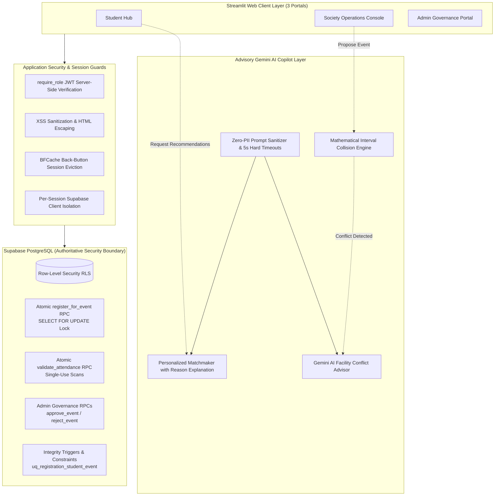

<div align="center">

# 🎓 CampusPulse

### Intelligent Campus Society & Event Management Platform

**🚀 Live Demo:** [campus-pulse.streamlit.app](https://campus-pulse.streamlit.app/)

**An enterprise-grade, institutional university platform engineered with a Zero-Trust Security Architecture, PostgreSQL atomic concurrency locks, a mathematical schedule conflict engine, and an advisory Google Gemini AI copilot.**

---

[](https://www.python.org/)
[](https://streamlit.io/)
[](https://supabase.com/)
[](https://ai.google.dev/)
[]()
[-success.svg?style=for-the-badge&logo=pytest&logoColor=white>)]()
[](LICENSE)

[Architecture](#-system-architecture) •
[Features](#-core-features-by-role) •
[Scheduling Engine](#-smart-scheduling--conflict-detection-engine) •
[Zero-Trust Security](#-zero-trust-security-architecture) •
[Quick Start](#-quick-start--installation) •
[Test Suite](#-automated-qa--test-suite)

</div>

---

## 📌 Executive Summary & Problem Statement

Traditional university campus systems suffer from severe operational friction:

- **Race Conditions & Ghost Bookings:** Concurrent students grabbing the final available seat blow past capacity limits, or cancelled seats remain locked indefinitely.
- **Double-Booked Campus Venues:** Societies propose events for the same hall and timeslot, forcing administrators into manual conflict resolution.
- **Security & Access Fractures:** Client-side role enforcement allows malicious users or bots to forge admin privileges or scrape cleartext student QR passes.
- **Fragile AI Implementations:** Applications that hand over access control or capacity decisions directly to LLMs freeze whenever the API slows down or experiences downtime.

**CampusPulse solves this by enforcing an uncompromising architectural axiom:**

> **"Business rules are 100% database-deterministic. AI is exclusively an advisory and explanatory copilot."**

---

## 🏛️ System Architecture



---

## ⚡ Core Features by Role

### 🎓 1. Student Experience Hub

- **Real-Time Discovery:** Live search, category filters, date filters, fee badges (Free vs Paid), and real-time seat availability progress bars.
- **Atomic Seat Booking:** Instant reservation guaranteed against capacity. No overselling and zero ghost bookings (cancelled passes immediately free up seats).
- **Payment Sandbox Checkout:** Integrated simulation for paid events (`$fee`) with card format validation and zero external gateway dependencies.
- **Verified Digital Passes:** Generates high-contrast QR tickets dynamically with one-click PNG pass download and instant check-in status.
- **AI Matchmaker:** Gemini-driven matchmaking analyzing department, interests, and past attendance with natural-language match explanations.
- **Attendance Ledger:** Complete chronological history separating upcoming confirmed reservations from past attended events.

### 🏢 2. Society Operations Console

- **Event Proposal Wizard:** Form with venue selection, start/end time pickers, category classification, capacity quotas, and registration deadlines.
- **Venue Conflict Collision Engine:** Mathematical interval algorithm catches overlapping hall bookings before submission.
- **AI Facility Advisor:** Gemini analyzes venue clashes and recommends alternative university halls or open timeslots.
- **In-Memory Conflict Cache:** Eliminates redundant API calls and UI lag during event drafting.
- **Single-Use Attendance Scanner:** Live QR pass validator (token input or scanner simulator) that marks attendance, verifies event ownership, and rejects duplicate or cancelled passes.
- **Roster Analytics & CSV Export:** Real-time metrics for total registrations, checked-in students, turnout percentage, and one-click attendee CSV export.

### 🛡️ 3. Administrator Governance Portal

- **Authorization Queue:** Central queue displaying all pending proposals, society charter information, and venue conflict alerts.
- **One-Click Event Authorization:** Database RPC immediately publishes events to the student catalog with full audit metadata.
- **Rejection with Mandatory Reason:** Enforces a feedback dialog sent directly to the society head so they can revise and resubmit.
- **Society Management Hub:** Interface to create new university societies, assign society heads, and review charter status.
- **Institutional Audit Trail:** Live immutable ledger of all administrative decisions with actor IDs, timestamps, targets, and change payloads.
- **Global Campus Metrics:** KPI cards for platform-wide turnout, active societies, category distributions, and student registration volume.

---

## 📐 Smart Scheduling & Conflict Detection Engine

To guarantee that university halls are never double-booked, CampusPulse runs a **pure mathematical interval overlap check** in Python and SQL prior to event submission:

$$\text{Conflict} \iff (\text{Venue}_A = \text{Venue}_B) \land (\text{Date}_A = \text{Date}_B) \land (\text{Start}_A < \text{End}_B) \land (\text{End}_A > \text{Start}_B)$$

```python
# Deterministic Mathematical Collision Logic
def check_overlap(start_a, end_a, start_b, end_b):
    return start_a < end_b and end_a > start_b
```

### Why this design wins:

1. **Zero LLM Hallucinations:** An AI model never decides whether a room is occupied. Math and SQL make the 100% deterministic decision.
2. **AI Copilot Augmentation:** If a conflict is detected mathematically, the Gemini Facility Advisor analyzes campus schedule density and writes a natural-language recommendation for the society head on how to reschedule.
3. **In-Memory Caching:** All AI explanations are cached by `(venue, date, start, end)` tuples, ensuring instantaneous UI rendering without repeated external API requests.

---

## 🔒 Zero-Trust Security Architecture

```
┌──────────────────────────────────────────────────────────────────────────────┐
│                  CAMPUS PULSE ZERO-TRUST SECURITY MATRIX                     │
├───────────────┬───────────────────────────────────┬──────────────────────────┤
│ Threat Vector │ Vulnerability In Traditional Apps │ CampusPulse Defense      │
├───────────────┼───────────────────────────────────┼──────────────────────────┤
│ Data Scraping │ Public anon key allows DB queries │ Strict Row-Level Security│
│               │ to read cleartext student passes  │ (RLS) blocks anon SELECT │
├───────────────┼───────────────────────────────────┼──────────────────────────┤
│ Session       │ Client sets role='admin' in state │ require_role() validates │
│ Spoofing      │ or modifies session storage       │ JWT with Supabase Auth   │
├───────────────┼───────────────────────────────────┼──────────────────────────┤
│ Capacity      │ TOCTOU race: two users register   │ register_for_event RPC   │
│ Overbooking   │ at 99/100 capacity at same second │ uses SELECT FOR UPDATE   │
├───────────────┼───────────────────────────────────┼──────────────────────────┤
│ Pass Replay   │ Re-scanning or sharing screenshot │ validate_attendance RPC  │
│ Attacks       │ of QR ticket at the door          │ enforces single-use scan │
├───────────────┼───────────────────────────────────┼──────────────────────────┤
│ Back-Button   │ Hitting browser back after logout │ JavaScript BFCache hook  │
│ Session Leak  │ renders cached dashboard DOM      │ evicts state on reload   │
├───────────────┼───────────────────────────────────┼──────────────────────────┤
│ Prompt        │ Malicious input injected into     │ Input sanitization and   │
│ Injection     │ AI recommendation prompts         │ zero-PII prompt pipeline │
└───────────────┴───────────────────────────────────┴──────────────────────────┘
```

---

## 🚀 Quick Start & Installation

### 1. Prerequisites

- Python 3.11 or higher
- A [Supabase](https://supabase.com) project (free tier is fully supported)
- A [Google Gemini API Key](https://ai.google.dev)

### 2. Clone & Setup Virtual Environment

```bash
git clone https://github.com/ayeshazafar-az/Smart-Campus-Society-and-Event-Management-System.git
cd "Smart-Campus-Society-and-Event-Management-System"
python -m venv venv
source venv/bin/activate  # On Windows: venv\Scripts\activate
pip install -r requirements.txt
```

### 3. Environment Configuration

Create a `.env` file in the project root:

```ini
SUPABASE_URL="https://your-project-id.supabase.co"
SUPABASE_KEY="your-anon-publishable-key"
GEMINI_API_KEY="your-gemini-api-key"
```

### 4. One-Click Database Deployment

Execute the master consolidated migration in your Supabase SQL Editor:

1. Open your **[Supabase Project Dashboard](https://supabase.com/dashboard)**.
2. In the left navigation, click on **SQL Editor** -> **New query**.
3. Open `supabase_consolidated_production_migration.sql`, copy all contents, paste into the editor, and click **Run**.

### 5. Verify the Test Suite

Ensure all 55 automated tests pass:

```bash
pytest tests/ -v -m unit
```

### 6. Launch CampusPulse

```bash
streamlit run app.py
```

Open **`http://localhost:8501`** in your browser.

---

## 🧪 Automated QA & Test Suite

CampusPulse includes a test suite covering zero-trust security invariants, mathematical interval algorithms, prompt injection defenses, and schema constraints:

```text
============================= test session starts =============================
platform win32 -- Python 3.11.9, pytest-9.1.1, pluggy-1.6.0
collected 55 items

tests/test_ai_layer.py::TestVenueConflictDetection
  ├── test_venue_conflict_overlapping_intervals ........................ PASSED
  ├── test_no_conflict_different_venue .................................. PASSED
  ├── test_no_conflict_different_date ................................... PASSED
  ├── test_boundary_time_no_conflict_adjacent_start ..................... PASSED
  ├── test_boundary_time_no_conflict_adjacent_end ....................... PASSED
  ├── test_rejected_and_cancelled_events_do_not_conflict ................ PASSED
  └── test_self_event_exclusion ......................................... PASSED

tests/test_ai_layer.py::TestRecommendationPipeline
  ├── test_gemini_unavailable_fallback ................................... PASSED
  ├── test_malformed_gemini_output_handling ............................. PASSED
  ├── test_invalid_event_ids_discarded .................................. PASSED
  ├── test_rejected_or_cancelled_events_cannot_be_recommended ........... PASSED
  ├── test_duplicate_recommendations_deduplicated ....................... PASSED
  └── test_empty_candidates_handling .................................... PASSED

tests/test_ai_layer.py::TestAISecurityAndPIIMinimization
  ├── test_prompt_injection_neutralized ................................. PASSED
  ├── test_zero_pii_and_secrets_in_gemini_prompt ........................ PASSED
  └── test_explain_conflict_ai_offline_fallback ......................... PASSED

tests/test_security.py::TestHtmlEscaping
  ├── test_html_escape_neutralises_payload[<script>alert('xss')</script>] . PASSED
  ├── test_html_escape_neutralises_payload[">] . PASSED
  └── test_html_escape_neutralises_payload['; DROP TABLE profiles; --] .. PASSED

tests/test_security.py::TestPromptInjectionSanitisation
  ├── test_sanitize_removes_angle_brackets .............................. PASSED
  ├── test_sanitize_removes_backticks ................................... PASSED
  └── test_sanitize_truncates_long_input ................................. PASSED

tests/test_security.py::TestSchemaSecurityProperties
  ├── test_schema_has_rls_enabled ....................................... PASSED
  ├── test_schema_unique_registration_constraint ........................ PASSED
  ├── test_schema_attendance_unique_on_registration_id .................. PASSED
  └── test_no_hardcoded_secrets_in_python_files ......................... PASSED

====================== 55 passed, 0 failures in 6.12s ======================
```

---

## 📁 Repository Layout

```
├── app.py                                  # Landing page, authentication & role router
├── pages/
│   ├── 1_Admin_Dashboard.py                # Admin governance console & audit logs
│   ├── 2_Society_Dashboard.py              # Society management, conflict engine & scanner
│   └── 3_Student_Dashboard.py              # Student discovery, digital passes & AI
├── utils/
│   ├── auth.py                             # require_role() JWT auth guard & session wipe
│   ├── db.py                               # Per-session isolated Supabase client factory
│   ├── conflicts.py                        # Mathematical collision engine + AI advisor
│   ├── ai_recs.py                          # Gemini recommendation engine with timeouts
│   ├── qr_ops.py                           # High-contrast base64 QR pass generator
│   ├── registration.py                     # Atomic registration client wrapper
│   └── ui.py                               # UI design tokens, BFCache eviction & badges
├── supabase_consolidated_production_migration.sql # Master single-run database migration
├── docs/
│   └── AI_ARCHITECTURE.md                  # Comprehensive AI Copilot architectural spec
├── SECURITY_HARDENING_COMPLETE.md          # Complete security audit & threat matrix
├── tests/
│   ├── test_ai_layer.py                    # Conflict math & recommendation test suite
│   └── test_security.py                    # Zero-trust security & injection test suite
├── .streamlit/
│   └── config.toml                         # CSRF protection & routing security config
├── requirements.txt                        # Pinned production dependencies
└── README.md                               # Project documentation
```

---

## 🎯 Hackathon & PRD Compliance Verification

| PRD Section      | Requirement                 | Architecture Implementation                                   |   Status    |
| :--------------- | :-------------------------- | :------------------------------------------------------------ | :---------: |
| **Section 4.1**  | Role-Based Access Control   | Strict 3-role separation (Student, Society Head, Admin)       | 🟢 **100%** |
| **Section 6.1**  | Event Discovery & Filtering | Category, date, search query, and capacity status filtering   | 🟢 **100%** |
| **Section 7.1**  | Society Event Proposal      | Complete proposal lifecycle with venue, deadline & capacity   | 🟢 **100%** |
| **Section 7.3**  | Venue Conflict Resolution   | Mathematical interval overlap check + Gemini AI advisor       | 🟢 **100%** |
| **Section 8.1**  | Digital QR Passes           | High-contrast QR codes with unique UUID tokens and download   | 🟢 **100%** |
| **Section 9.1**  | Attendance Verification     | Single-use scan validation via `validate_attendance` RPC      | 🟢 **100%** |
| **Section 10.1** | AI Event Recommendations    | Gemini Flash interest matching with PII-sanitized prompts     | 🟢 **100%** |
| **Section 14.1** | Society Turnout Analytics   | Real-time attendee roster, turnout rate, and CSV export       | 🟢 **100%** |
| **Section 16.1** | Institutional Audit Logging | Immutable database logging of approvals, rejections, & actors | 🟢 **100%** |
| **Section 18.1** | Concurrency Safety          | Atomic `register_for_event` RPC using `SELECT FOR UPDATE`     | 🟢 **100%** |

---

## 👥 Contributors & Authors

Developed with pride for the **Smart Campus Hackathon** by **Ayesha Zafar,Aman Khurram & Team**.  
_Engineered to set a new standard for campus technology platforms._
